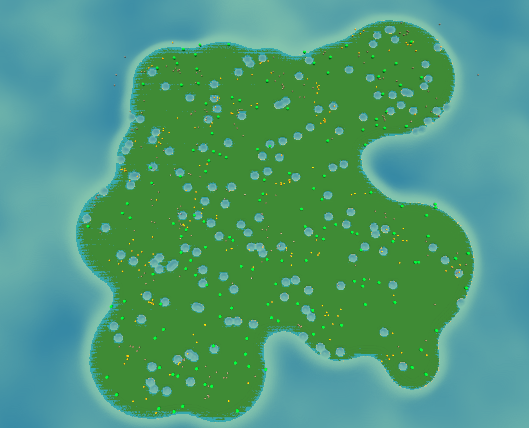

# Ecosystem Simulation 🐇
This is a basic ecosystem simulation game made with a Raylib port (Vinculum) in C#. It features different organisms that interact with eachother (ex. fox, rabbit, bush) as well as a random island generator for the play area and various features for understanding the simulation and logging results.
## Repository Stats 📊
[](https://github.com/OpEnchanter/ecosystems/actions/workflows/build.yml)

## Controls 🕹️
### **Movement**
  - **Forward** : `W`
  - **Backward** : `S`
  - **Left** : `A`
  - **Right** : `D`
  - **Down** : `Left Control`
  - **Up** : `Space`
  - **Sprint** : `Shift`
  - **Interact**: `Left Click`
### **Menus**
  - **Open menu** : `Tab`
  - **Use the menu**: The menu has options for logging data, quitting the game, turning on debug mode and turning on cheats.
  - **Open god menu**: `Left click on organism`
  - **Use god meny**: The god menu allows you to interact with organisms such as killing them feeding them and hydrating them.

## Logging Display 📈
The python file in `plot/python` can be used to visualize the logs generated by the program.

**Prerequisites**
- `pandas`
- `matplotlib`

These prerequisites can be installed with
```pwsh
pip install pandas matplotlib
```

The graph can be loaded and run with
```pwsh
cd ./plot/python
python main.py
```

## Examples 📃
These are some examples of environments that have been generated within the simulation.



## Getting Started 🚀
1. Download the `.zip` from the releases on this page.
2. Unzip the file.
3. Run the `.exe` (if prompted asking if you want to run the file click more options, then run anyway).

## Compile from source 💾

### Prerequisites
- **.NET**: Ensure that you have the .NET SDK installed on your computer.

### Run the simulation
1. Clone the repository
```bash
git clone https://github.com/OpEnchanter/ecosystems.git
```
2. Navigate to the project's directory
```bash
cd ecosystems
```
3. Build and run
```bash
dotnet run
```

## Code examples
If you want to modify the simulation to add your own personal organisms you can create the organism and make it spawn by modifying `Program.cs`.

> **Note**: You should have a decent understanding of `C#` before attempting to modify the code.

### Load the model
Load the organism's model and texture and use them.
```cs
Image image = Raylib.LoadImage("texture.png"); // Load the texture as an Image
Texture texture = Raylib.LoadTextureFromImage(image); // Load Texture from image

Model model = Raylib.LoadModelFromMesh("model.obj"); // Load model
model.materials[0].maps[(int)MaterialMapIndex.MATERIAL_MAP_ALBEDO].texture = texture; // Apply texture to model
model.materials[0].shader = lit; // Apply lit shader to model
```

### Create the organism
Create a new organism and give it a model and position, then modify it's traits (note that it will evolve and the traits will change).
```cs
Organism organism = new Organism() {
  model = model;
  organismPosition = new Vector3(0,0,0);
} // Create and organism with a model and position
// Modify organism traits
organism.traits.eyesight = 10.0f;
organism.traits.speed = 1.0f;
organism.traits.oType = organismType.CustomOrganism; // A new organism type must be added to the organismType enum
organism.traits.foodSources = new organismType[] { organismType.Bush }; // What the organism can eat
organism.traits.hydrationSources = new fluidType[] { fluidType.Water }; // How the organism can get hydration
```

### Make the organism spawn
Modify the function call beginning on line 601 to include a number and reference to your organism.
```cs
placeFeatures(new Dictionary<basicRenderable, int>
{
  { bush, 150 },
  { fox, 120 },
  { rabbit, 120 },
  { organism, 400} // This will spawn 400 of organism on the island
}, *groundHeightmap, terrainThreshold);
```